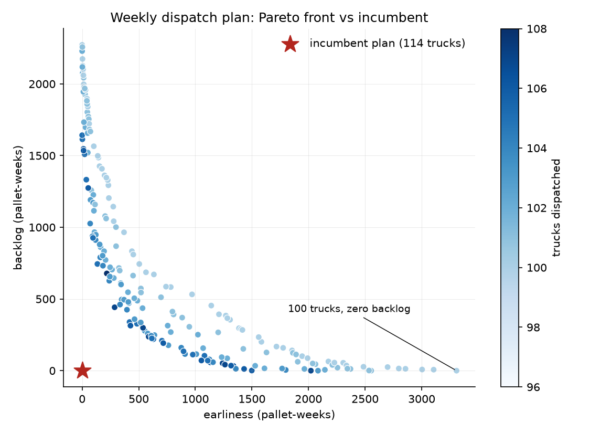
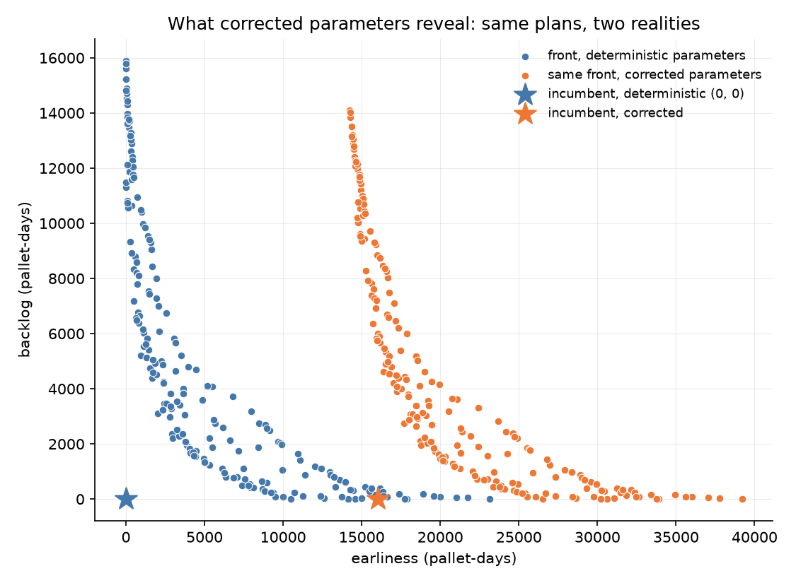
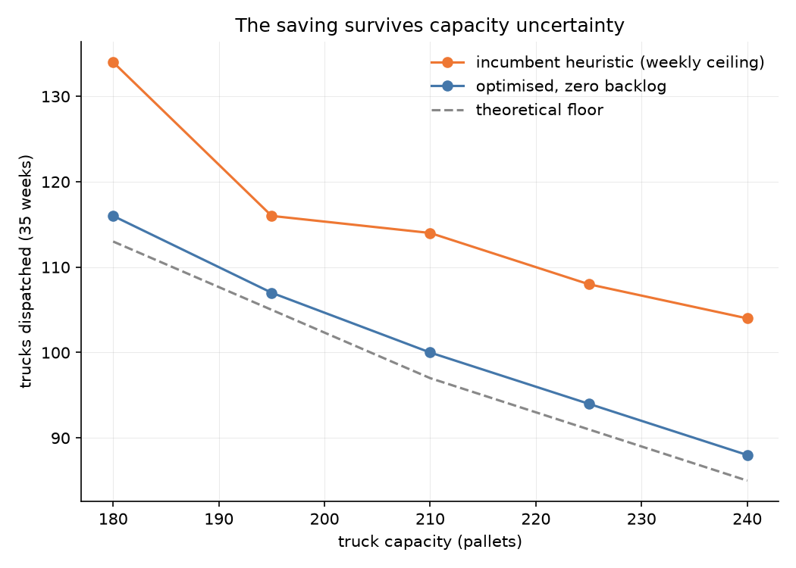
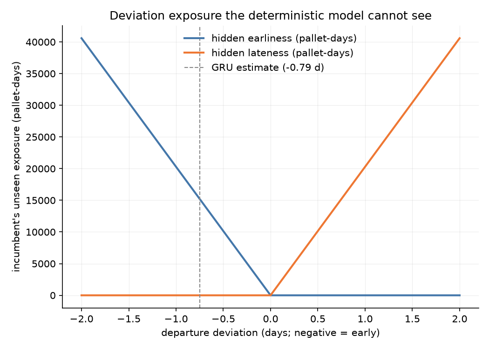
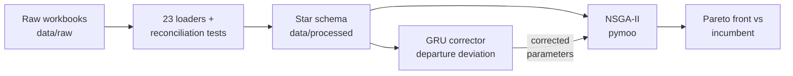

# sc-transport-optimization

Multi-objective transport optimisation with a learned corrector for the SCOR Deliver function of an automotive Tier 1 export supply chain. Practical component of an MSc dissertation in Logistics and Supply Chain Management (University of Hull, 2026) on AI integration in supply chain digital twins.

The thesis in one sentence: a supply chain runs on promises (a planned departure, a quoted lead time, a nominal route time, a contractual return cycle); a small recurrent network can learn each promise's systematic error from execution data, and feeding that correction back into an optimiser reveals operational reality the deterministic planning model cannot represent.

## Headline results

All numbers below are produced by the code in this repository from the anonymised dataset and are pinned by tests.

| Result | Value |
|---|---|
| Incumbent plan, decoded | 114 trucks for 20,293 pallets over 35 weeks; the company's schedule equals the weekly ceiling rule in 35 of 35 weeks, leaving 3,647 spare pallet-slots (15% empty capacity) |
| Theoretical floor | 97 trucks |
| NSGA-II, zero-backlog optimum | **100 trucks** (12.3% fewer dispatches at unchanged service), paying 3,308 pallet-weeks of pull-forward |
| Seed robustness | zero-backlog optimum at 100 or 101 trucks in all ten seeds |
| Capacity sensitivity | saving of 9 to 18 trucks holds across 180 to 240 pallets per truck; the 210 constant is unverified with the company, so the claim is bounded rather than assumed |
| GRU corrector, validation MAE | **0.071 days** against 0.378 (global mean), 0.113 (per-lane mean) and 0.049 (persistence): beats both means, loses to persistence on one low-variance month |
| Corrected departure deviation | -0.734 days (CA lane), -0.896 days (TX lane), -0.79 days per pallet demand-weighted |
| What the correction reveals | the incumbent, perfect at (0, 0) under its own deterministic assumptions, carries **16,043 early pallet-days**; re-optimisation under corrected objectives reaches 102 dispatches at zero lateness |
| SCOR corrector suite (synthetic, seed 42) | same architecture, unchanged: Source 1.346 d (best baseline 1.384), Make 2.509 min (best baseline 3.199), Return 1.942 d (best baseline 1.947) |

Every scorecard includes adversarial baselines (global mean, per-entity mean, persistence). Where a baseline wins, the table says so.

## Figures

| | |
|---|---|
|  |  |
| Weekly dispatch plan: the Pareto front against the incumbent (114 trucks). The 100-truck, zero-backlog solution sits at the right-hand end. | Integration: the same front scored under deterministic and corrected parameters. The incumbent moves from (0, 0) to 16,043 early pallet-days. |
|  |  |
| The saving survives capacity uncertainty: optimised plans hug the theoretical floor across 180 to 240 pallets per truck; the heuristic never closes the gap. | Deviation exposure the deterministic model cannot see: linear and symmetric in the departure bias, 16,043 pallet-days at the corrector's estimate. |

## Method

Two components with a deliberate division of labour. The optimiser makes decisions; the neural network improves the data those decisions consume.

- **NSGA-II** ([pymoo](https://pymoo.org/) 0.6): 35 integer decision variables (pallets shipped per week), a repair operator that keeps every candidate feasible by largest-remainder normalisation to the released total, and three objectives: trucks dispatched (weekly ceiling rule), earliness and backlog in pallet-weeks. The incumbent plan is evaluated under identical objectives and sits on the front as the on-time corner.
- **GRU corrector** (PyTorch): one hidden layer of 16 units, 1,073 parameters, trained with Adam on an L1 loss over standardised features. It reads lane-day sequences of the June export register (planned departure against goods issue) and forecasts the next day's departure deviation per lane. The demand-weighted forecast shifts every pallet's effective arrival, and plans are re-scored and re-optimised at day resolution.
- **One architecture, five promises.** The same `GRUCorrector` class is imported unchanged by the Source, Make and Return correctors, each trained on a seeded synthetic scenario with the mechanisms that function is known for (lead-time drift, AR(1) machine congestion, dwell-dominated rack cycles). The control-systems reading (unit delay, update gate as adaptive pole, tanh saturation) and every equation with its nomenclature are in [docs/formulation.md](docs/formulation.md).



## Repository layout

```
src/data/loaders.py             # 23 bespoke per-sheet extractors for five workbooks
src/data/dimensions.py          # hand-curated lane dictionary (72 spellings to 47 lanes), part dimension (670 pairs)
src/data/build.py               # fact_release (3,133), fact_shipments (502), fact_inventory (3,913) to parquet
src/optimization/problem.py     # pymoo Problem, repair operator, incumbent evaluation
src/optimization/run_nsga2.py   # seeded runner, persisted front and figure
src/optimization/integrate.py   # corrected parameters re-enter the optimiser
src/optimization/experiments.py # seed robustness, capacity and deviation sweeps
src/models/gru_corrector.py     # panel, sequences, GRUCorrector, training loop, baselines
src/models/train_gru.py         # Deliver corrector on the real register
src/models/source_corrector.py  # Source promise, lead-time drift scenario
src/models/make_corrector.py    # Make promise, AR(1) congestion scenario
src/models/return_corrector.py  # Return promise, rack-cycle scenario
tests/                          # 48 tests
docs/formulation.md             # mathematical formulation with nomenclature tables
docs/plan.md                    # build plan with phase-by-phase status
docs/figures/                   # the four result figures above
ANONYMIZATION_README.md         # the pseudonymisation scheme the dataset follows
```

## Reproduction

```bash
python -m venv .venv && .venv\Scripts\activate    # Windows; use source .venv/bin/activate elsewhere
pip install -r requirements.txt
```

With the anonymised workbooks in `data/raw/`, run the pipeline in order. Every step is seeded and writes its outputs under `data/processed/`.

```bash
python -c "from src.data.build import write_processed; print(write_processed())"
python -m src.optimization.run_nsga2
python -m src.models.train_gru
python -m src.optimization.integrate
python -m src.optimization.experiments
python -m src.models.source_corrector
python -m src.models.make_corrector
python -m src.models.return_corrector
```

## Tests

```bash
pytest
```

48 tests. Twenty-nine are reconciliation tests over the loaders: every pinned total, cross-file identity and pack-integrality check is a documented data-quality finding, and each caught a silent loss at least once during development (a lot filter that dropped 290 real lots, a description filter that dropped 198 pieces of demand). The remainder cover the optimisation problem, the corrector, the integration loop and the experiments.

Data-dependent tests skip themselves when `data/raw/` is absent, so a fresh clone reports 5 passed and 43 skipped; the five that run build their own synthetic scenarios.

## Data and privacy

The dataset is a June 2026 export register plus four planning workbooks from an automotive Tier 1 supply chain, obtained through industry practitioners and pseudonymised under the scheme in [ANONYMIZATION_README.md](ANONYMIZATION_README.md). Monetary values are scaled by an undisclosed constant, so only relative analysis is meaningful.

The dataset is **not** part of this repository and never will be. `.gitignore` excludes `data/`, every tabular format and the mapping key, and a pre-commit hook refuses any such path. Nothing in the code, comments, commit history or documentation identifies the company, its plants, customers, lanes, programmes or practitioners.

## Context

MSc in Logistics and Supply Chain Management, University of Hull, undertaken as a dual degree alongside Ingeniería Mecatrónica at Tecnológico de Monterrey. The practical component was completed in August 2026 and the dissertation submitted in September 2026. A co-authored paper extending the corrector-per-promise pattern across the SCOR model, with practitioner interviews, is in preparation for December 2026.
