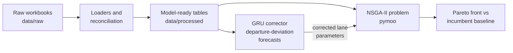

# Project Plan: Transport Optimisation Pipeline (NSGA-II + GRU Corrector)

Practical component of the MSc dissertation *AI Integration in Supply Chain Digital
Twins* (SCOR Deliver function, automotive Tier 1 export supply chain). The optimiser
makes decisions; the neural network improves the data those decisions consume.

## 1. Scope

- **Core experiment**: the OEM-A outbound pallet scope (two US lanes, CA/TX), where the
  company's incumbent heuristic plan (`SCHEDULED TRUCKS`) exists as a benchmark.
- **Extension study**: the ten-lane bulk-release scope (five US regions, CN, NL).
- **Out of scope**: mode and forwarder selection (empirically degenerate in the data);
  monetary freight rates (absent; stated as exogenous assumptions).

## 2. Architecture



## 3. Optimisation problem

| Element | Definition | Data source |
|---|---|---|
| Objective: cost | Trucks dispatched per lane-week (rate-weighted) | Pallet pool forecast; Std Pack conversions |
| Objective: time | Weighted earliness against planned receipt dates | Bulk release lane transit times |
| Objective: service | Projected shortage / backorder exposure | Shipping management shortage columns; urgent lists |
| Decision variables | Trucks per lane-week; ship-date shifts (pallet-integral); consolidation; expedite binaries | Release lines; slot timetable |
| Constraints | Truck capacity; pack integrality; inventory balance; production inflow; customs lag; due dates | Inventory, production plan, packaging parameters |

The incumbent `SCHEDULED TRUCKS` plan is evaluated under identical objectives as the
baseline solution every Pareto front is compared against. The implemented core
formulation is the pooled-weekly version of this table (pallets per week as the
decision, trucks by the ceiling rule, earliness and backlog in pallet-weeks); the
exact statement is in `formulation.md`.

## 4. GRU corrector

Trained on the June 2026 export register (the only plan-plus-execution source):
lane-day sequences of departure deviation, forecast one day ahead and folded into
the optimiser's parameters in place of the deterministic zero-deviation assumption.
Customs lag was profiled but left as an extension: only 293 of the 502 deliveries
carry both dates it needs. Honest limits, stated in the dissertation: one month of
actuals; the departure signal is low-variance; per-lane-mean and persistence
baselines are part of the evaluation so the network's added value is measurable.
Transit-time (arrival-side) deviation is not constructible from the available data.

## 5. Repository layout

```
src/data/loaders.py             # 23 bespoke per-sheet extractors
src/data/dimensions.py          # dim_lane (hand-curated, 72 spellings to 47 lanes), dim_part
src/data/build.py               # fact tables -> data/processed (parquet, gitignored)
src/optimization/problem.py     # pymoo Problem, repair operator, incumbent evaluation
src/optimization/run_nsga2.py   # seeded runner, persisted front and figure
src/optimization/integrate.py   # corrected parameters re-enter the optimiser
src/optimization/experiments.py # seed robustness, capacity and deviation sweeps
src/models/gru_corrector.py     # the GRU corrector: panel, sequences, model, baselines
src/models/train_gru.py         # Deliver corrector runner (real data)
src/models/source_corrector.py  # Source promise on a seeded synthetic scenario
src/models/make_corrector.py    # Make promise, AR(1) congestion scenario
src/models/return_corrector.py  # Return promise, dwell-dominated rack cycles
tests/                          # 48 tests: reconciliation, problem, GRU, integration, experiments
docs/formulation.md             # full mathematical formulation with nomenclature
docs/figures/                   # result figures embedded in the README
data/raw | data/processed       # gitignored
```

## 6. Build phases

1. **Environment**: venv, requirements (pandas, openpyxl, pymoo, PyTorch).
   *Complete (August 2026).*
2. **Loaders + reconciliation tests**: the hardest data engineering; fail loudly.
   *Complete (August 2026): every sheet of the five workbooks loads via
   `src/data/loaders.py`, verified by 29 reconciliation tests. Incumbent baseline
   established: 114 trucks over 35 weeks with 3,647 spare pallet-slots (~15%
   empty capacity).*
3. **Dimensions and facts**: including the manual lane dictionary (documented).
   *Complete (August 2026): dim_lane (47 canonical lanes covering all 72 raw
   location spellings, two merges documented as open questions), dim_part
   (670 revision pairs merged from three part masters), and three
   lane-resolved fact tables persisted to data/processed as parquet.*
4. **NSGA-II core**: two-lane scope, three objectives, incumbent benchmark.
   *Complete (August 2026), pooled-weekly formulation matching the incumbent's
   granularity (per-lane refinement remains an extension study). The incumbent
   is provably the weekly-ceiling heuristic and scores (114 trucks, 0, 0);
   the optimised front reaches 100 trucks at zero backlog (12.3% fewer dispatches
   at unchanged service) against a theoretical floor of 97.*
5. **GRU corrector**: training set, naive baselines, deviation forecasts.
   *Complete (August 2026): nine-lane lane-day panel from the June register,
   276 sequences of 7 days by 5 features, time-ordered 177/99 split. Validation
   MAE 0.071 days against 0.378 (global mean), 0.113 (lane mean) and 0.049
   (persistence). The network beats both means and loses to persistence on one
   quasi-static month; the scorecard is reported as found.*
6. **Integration**: corrected parameters, re-optimise, compare Pareto fronts.
   *Complete (August 2026). Day-resolution scoring with the corrector's
   demand-weighted departure deviation (-0.79 days/pallet): the incumbent,
   perfect under deterministic assumptions, reveals 16,043 early pallet-days
   under corrected parameters; all zero-backlog optimised plans remain
   zero-late (robust); corrected re-optimisation reaches 102 dispatches at
   zero lateness.*
7. **Experiments and write-up assets.**
   *Complete (August 2026): seed robustness (zero-backlog optimum at 100 or
   101 trucks in all ten seeds), capacity sensitivity (savings of 9 to 18
   trucks across 180 to 240 pallets/truck) and deviation sensitivity (exposure
   linear and symmetric in the bias; 16,043 pallet-days at the corrector's
   estimate). Write-up assets delivered: the mathematical formulation with
   nomenclature, the result figures, and the SCOR-wide corrector suite
   (Source, Make, Return) on seeded synthetic scenarios. The dissertation was
   submitted in September 2026.*

## 7. Open items for the company

- Actual arrival / receipt (ASN) data, which would restore arrival-side correction.
- Additional monthly export registers and planning-workbook snapshots.
- Confirmation of the 210-pallet truck capacity constant (physically implausible
  for a single trailer; possibly pooled weekly capacity). The capacity sweep bounds
  the claim in the meantime.

## 8. Extensions (paper track, December 2026)

- Per-lane and bulk-release (ten-lane) NSGA-II formulations.
- A departure-event head for the corrector: the 12 booked-but-never-despatched
  lines in the June register are excluded from training today, so the corrector
  estimates how late a departure is, not whether one happens.
- Practitioner interviews across the five SCOR functions (Tec de Monterrey ethics
  track) to test the corrector-per-promise thesis against operational judgement.
